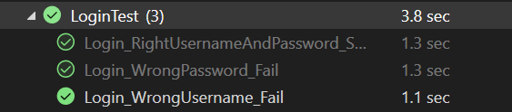
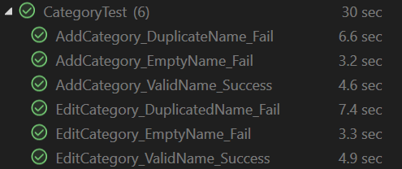
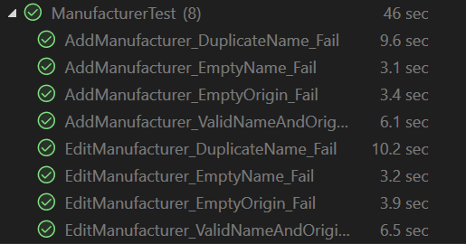
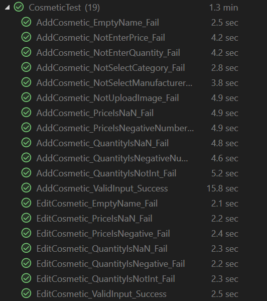
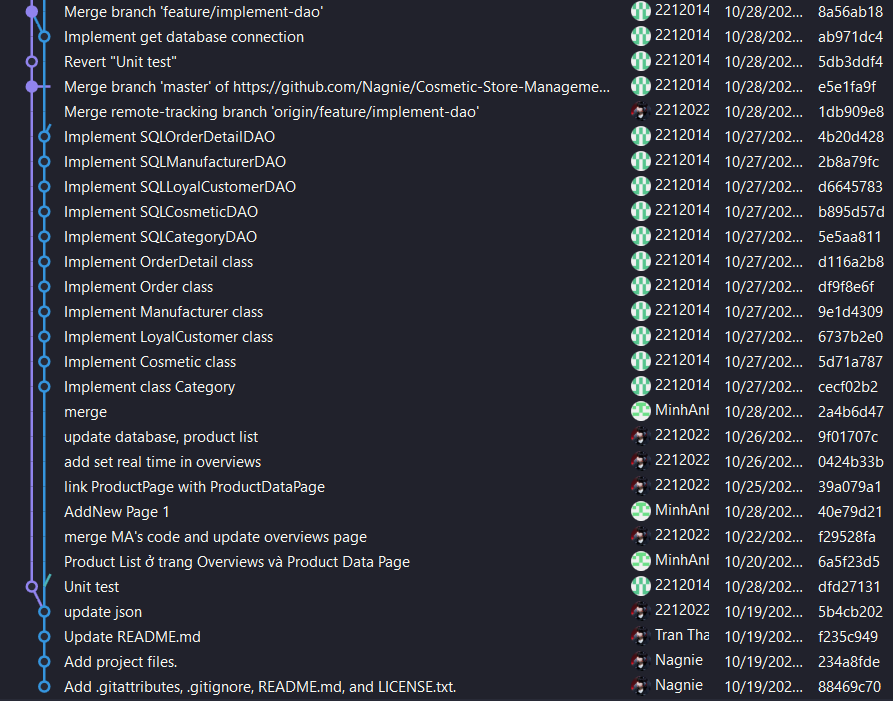
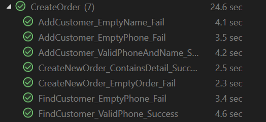

## 5. Đảm bảo chất lượng
### 5.1. Quy trình kiểm duyệt mã nguồn
1. Trước khi push code lên github, mỗi thành viên cần phải đảm bảo mã nguồn đạt được các tiêu chí: coding style (đặt tên biến và tên hàm có nghĩa, tuân theo quy ước đặt tên,...), không chứa lỗi cơ bản, đảm bảo thực hiện được chức năng, có chú thích đầy đủ nếu cần.
2. Sau khi push code lên github và tạo pull request, mã nguồn cần phải chờ review trước khi được quyết định merge. Leader sẽ đảm nhận vai trò chính đối với việc kiểm duyệt, hợp nhất mã nguồn và giải quyết các xung đột liên quan nếu có. Trong một số trường hợp cần thiết, các thành viên còn lại có thể linh hoạt thực hiện kiểm duyệt.
3. Nếu mã nguồn đảm bảo chất lượng sẽ được hợp nhất vào nhánh chính. Ngược lại, người review sẽ đánh giá và đề xuất cải tiến, sửa đổi. Người phát triển sẽ thực hiện sửa đổi và gửi lại để kiểm tra.

### 5.2. Quy trình đảm bảo chất lượng
- Xác định kịch bản kiểm thử dựa trên yêu cầu của các chức năng và hệ thống.
- Tiến hành kiểm thử:
    + Kiểm tra từng phần như lớp đối tượng, hàm,... một cách độc lập trong khi phát triển trước khi tích hợp vào hệ thống.
    + Sau khi kiểm tra từng thành phần, cần kiểm tra hệ thống hoạt động tốt khi tích hợp các thành phần lại với nhau trước khi tích hợp vào hệ thống.
- Phân tích và đánh giá kết quả kiểm thử:
    + Nếu kết quả kiểm thử không đạt yêu cầu, cần phải sửa lỗi và kiểm tra lại.
    + Nếu kết quả kiểm thử đạt yêu cầu, tiến hành tích hợp vào hệ thống.

#### 5.2.1. Automated Testing
Nhóm thực hiện viết các testcases cho một số chức năng. Mỗi khi có thay đổi, nhóm sẽ chạy testcases để đảm bảo chức năng vẫn hoạt động đúng như mong muốn.

##### a. Chức năng: Đăng nhập

- Testcase 1: Đăng nhập thành công với tài khoản hợp lệ
    + Input: username = "admin", password = "1234"
    + Expected output: Chuyển đến trang chính
    + Actual output: Chuyển đến trang chính, không hiển thị thông báo lỗi
- Testcase 2: Đăng nhập thất bại với tên đăng nhập không đúng
    + Input: username = "users", password = "1234"
    + Expected output: Hiển thị thông báo lỗi "Tên đăng nhập hoặc mật khẩu không đúng"
    + Actual output: Hiển thị thông báo lỗi "Tên đăng nhập hoặc mật khẩu không đúng"
- Testcase 3: Đăng nhập thất bại với mật khẩu không đúng
    + Input: username = "admin", password = "123456"
    + Expected output: Hiển thị thông báo lỗi "Tên đăng nhập hoặc mật khẩu không đúng"
    + Actual output: Hiển thị thông báo lỗi "Tên đăng nhập hoặc mật khẩu không đúng"

##### b. Chức năng: Quản lý danh mục sản phẩm

###### Thêm danh mục sản phẩm
- Testcase 1: Thêm danh mục sản phẩm thành công với tên hợp lệ
    + Input: Tên danh mục hợp lệ (không trùng với danh mục đã có)
    + Expected output: Hiển thị thông báo "Thêm danh mục sản phẩm thành công"
    + Actual output: Hiển thị thông báo "Thêm danh mục sản phẩm thành công"
- Testcase 2: Thêm danh mục sản phẩm thất bại với tên trùng với danh mục đã có
    + Input: Tên danh mục trùng với danh mục đã có
    + Expected output: Hiển thị dialog thông báo lỗi danh mục đã tồn tại
    + Actual output: Hiển thị dialog thông báo lỗi danh mục đã tồn tại
- Testcase 3: Thêm danh mục sản phẩm thất bại với tên rỗng
    + Input: Tên danh mục rỗng
    + Expected output: Hiển thị dialog thông báo lỗi tên danh mục không được để trống
    + Actual output: Hiển thị dialog thông báo lỗi tên danh mục không được để trống

###### Cập nhật danh mục sản phẩm
- Testcase 1: Cập nhật danh mục sản phẩm thành công với tên hợp lệ
    + Input: Tên danh mục hợp lệ (không trùng với danh mục đã có)
    + Expected output: Hiển thị thông báo "Cập nhật danh mục sản phẩm thành công"
    + Actual output: Hiển thị thông báo "Cập nhật danh mục sản phẩm thành công"
- Testcase 2: Cập nhật danh mục sản phẩm thất bại với tên trùng với danh mục đã có
    + Input: Tên danh mục trùng với danh mục đã có
    + Expected output: Hiển thị dialog thông báo lỗi danh mục đã tồn tại
    + Actual output: Hiển thị dialog thông báo lỗi danh mục đã tồn tại
- Testcase 3: Cập nhật danh mục sản phẩm thất bại với tên rỗng
    + Input: Tên danh mục rỗng
    + Expected output: Hiển thị dialog thông báo lỗi tên danh mục không được để trống
    + Actual output: Hiển thị dialog thông báo lỗi tên danh mục không được để trống

##### c. Chức năng: Quản lý nhà sản xuất sản phẩm

###### Thêm nhà sản xuất sản phẩm
- Testcase 1: Thêm nhà sản xuất sản phẩm thành công với tên và xuất xứ hợp lệ
    + Input: Tên nhà sản xuất hợp lệ (không trùng với nhà sản xuất đã có) và xuất xứ hợp lệ
    + Expected output: Hiển thị thông báo "Thêm nhà sản xuất thành công"
    + Actual output: Hiển thị thông báo "Thêm nhà sản xuất thành công"
- Testcase 2: Thêm nhà sản xuất sản phẩm thất bại với tên trùng với nhà sản xuất đã có
    + Input: Tên nhà sản xuất trùng với nhà sản xuất đã có
    + Expected output: Hiển thị dialog thông báo lỗi nhà sản xuất đã tồn tại
    + Actual output: Hiển thị dialog thông báo lỗi nhà sản xuất đã tồn tại
- Testcase 3: Thêm nhà sản xuất sản phẩm thất bại với tên rỗng
    + Input: Tên nhà sản xuất rỗng
    + Expected output: Hiển thị dialog thông báo lỗi tên nhà sản xuất không được để trống
    + Actual output: Hiển thị dialog thông báo lỗi tên nhà sản xuất không được để trống
- Testcase 4: Thêm nhà sản xuất sản phẩm thất bại với xuất xứ rỗng
    + Input: Tên nhà sản xuất hợp lệ (không trùng với nhà sản xuất đã có) và xuất xứ rỗng
    + Expected output: Hiển thị dialog thông báo lỗi xuất xứ không được để trống
    + Actual output: Hiển thị dialog thông báo lỗi xuất xứ không được để trống

###### Cập nhật nhà sản xuất sản phẩm
- Testcase 1: Cập nhật nhà sản xuất sản phẩm thành công với tên và xuất xứ hợp lệ
    + Input: Tên nhà sản xuất hợp lệ (không trùng với nhà sản xuất đã có) và xuất xứ hợp lệ
    + Expected output: Hiển thị thông báo "Cập nhật nhà sản xuất thành công"
    + Actual output: Hiển thị thông báo "Cập nhật nhà sản xuất thành công"
- Testcase 2: Cập nhật nhà sản xuất sản phẩm thất bại với tên trùng với nhà sản xuất đã có
    + Input: Tên nhà sản xuất trùng với nhà sản xuất đã có
    + Expected output: Hiển thị dialog thông báo lỗi nhà sản xuất đã tồn tại
    + Actual output: Hiển thị dialog thông báo lỗi nhà sản xuất đã tồn tại
- Testcase 3: Cập nhật nhà sản xuất sản phẩm thất bại với tên rỗng
    + Input: Tên nhà sản xuất rỗng
    + Expected output: Hiển thị dialog thông báo lỗi tên nhà sản xuất không được để trống
    + Actual output: Hiển thị dialog thông báo lỗi tên nhà sản xuất không được để trống
- Testcase 4: Cập nhật nhà sản xuất sản phẩm thất bại với xuất xứ rỗng
    + Input: Tên nhà sản xuất hợp lệ (không trùng với nhà sản xuất đã có) và xuất xứ rỗng
    + Expected output: Hiển thị dialog thông báo lỗi xuất xứ không được để trống
    + Actual output: Hiển thị dialog thông báo lỗi xuất xứ không được để trống

##### d. Chức năng: Quản lý sản phẩm

###### Thêm sản phẩm
- Testcase 1: Thêm sản phẩm thành công với tên, danh mục, nhà sản xuất, số lượng, giá hợp lệ, có upload hình ảnh
    + Input: Tên sản phẩm hợp lệ, giá hợp lệ, số lượng hợp lệ, danh mục hợp lệ, nhà sản xuất hợp lệ, upload hình ảnh
    + Expected output: Hiển thị thông báo "Thêm sản phẩm thành công"
    + Actual output: Hiển thị thông báo "Thêm sản phẩm thành công"
- Testcase 2: Thêm sản phẩm thất bại với tên rỗng
    + Input: Tên sản phẩm rỗng
    + Expected output: Hiển thị dialog thông báo lỗi tên sản phẩm không được để trống
    + Actual output: Hiển thị dialog thông báo lỗi tên sản phẩm không được để trống
- Testcase 3: Thêm sản phẩm thất bại với danh mục không xác định
    + Input: Tên sản phẩm hợp lệ, danh mục không xác định (chưa chọn danh mục)
    + Expected output: Hiển thị dialog thông báo lỗi danh mục sản phẩm không xác định
    + Actual output: Hiển thị dialog thông báo lỗi danh mục sản phẩm không xác định
- Testcase 4: Thêm sản phẩm thất bại với nhà sản xuất không xác định
    + Input: Tên sản phẩm hợp lệ, danh mục xác định, nhà sản xuất không xác định (chưa chọn nhà sản xuất)
    + Expected output: Hiển thị dialog thông báo lỗi nhà sản xuất sản phẩm không xác định
    + Actual output: Hiển thị dialog thông báo lỗi nhà sản xuất sản phẩm không xác định
- Testcase 5: Thêm sản phẩm thất bại với số lượng bằng 0 (không nhập số lượng)
    + Input: Tên sản phẩm hợp lệ, danh mục xác định, nhà sản xuất xác định, số lượng bằng 0
    + Expected output: Hiển thị dialog thông báo lỗi số lượng không hợp lệ
    + Actual output: Hiển thị dialog thông báo lỗi số lượng không hợp lệ
- Testcase 6: Thêm sản phẩm thất bại với số lượng là số âm
    + Input: Tên sản phẩm hợp lệ, danh mục xác định, nhà sản xuất xác định, số lượng là số âm
    + Expected output: Hiển thị dialog thông báo lỗi số lượng không hợp lệ
    + Actual output: Hiển thị dialog thông báo lỗi số lượng không hợp lệ
- Testcase 7: Thêm sản phẩm thất bại với số lượng là thập phân
    + Input: Tên sản phẩm hợp lệ, danh mục xác định, nhà sản xuất xác định, số lượng không là số nguyên
    + Expected output: Hiển thị dialog thông báo lỗi số lượng không hợp lệ
    + Actual output: Hiển thị dialog thông báo lỗi số lượng không hợp lệ
- Testcase 8: Thêm sản phẩm thất bại với số lượng không phải là số
    + Input: Tên sản phẩm hợp lệ, danh mục xác định, nhà sản xuất xác định, số lượng là chuỗi ký tự
    + Expected output: Hiển thị dialog thông báo lỗi số lượng không hợp lệ
    + Actual output: Hiển thị dialog thông báo lỗi số lượng không hợp lệ
- Testcase 9: Thêm sản phẩm thất bại với giá bằng 0 (không nhập giá)
    + Input: Tên sản phẩm hợp lệ, danh mục xác định, nhà sản xuất xác định, số lượng hợp lệ, giá bằng 0
    + Expected output: Hiển thị dialog thông báo lỗi giá không hợp lệ
    + Actual output: Hiển thị dialog thông báo lỗi giá không hợp lệ
- Testcase 10: Thêm sản phẩm thất bại với giá là số âm
    + Input: Tên sản phẩm hợp lệ, danh mục xác định, nhà sản xuất xác định, số lượng hợp lệ, giá là số âm
    + Expected output: Hiển thị dialog thông báo lỗi giá không hợp lệ
    + Actual output: Hiển thị dialog thông báo lỗi giá không hợp lệ
- Testcase 11: Thêm sản phẩm thất bại với giá không phải là số
    + Input: Tên sản phẩm hợp lệ, danh mục xác định, nhà sản xuất xác định, số lượng hợp lệ, giá không phải là số
    + Expected output: Hiển thị dialog thông báo lỗi giá không hợp lệ
    + Actual output: Hiển thị dialog thông báo lỗi giá không hợp lệ
- Testcase 12: Thêm sản phẩm thất bại với hình ảnh không được chọn
    + Input: Tên sản phẩm hợp lệ, danh mục xác định, nhà sản xuất xác định, số lượng hợp lệ, giá hợp lệ, không upload hình ảnh
    + Expected output: Hiển thị dialog thông báo lỗi hình ảnh không được để trống
    + Actual output: Hiển thị dialog thông báo lỗi hình ảnh không được để trống

###### Cập nhật sản phẩm
Chỉ cho phép cập nhật tên, số lượng, giá, hình ảnh và mô tả của sản phẩm với hình ảnh và mô tả không bắt buộc.
- Testcase 1: Cập nhật sản phẩm thành công với tên, danh mục, nhà sản xuất, số lượng, giá hợp lệ, có upload hình ảnh
    + Input: Tên sản phẩm hợp lệ, giá hợp lệ, số lượng hợp lệ, danh mục hợp lệ, nhà sản xuất hợp lệ, upload hình ảnh
    + Expected output: Hiển thị thông báo "Cập nhật sản phẩm thành công"
    + Actual output: Hiển thị thông báo "Cập nhật sản phẩm thành công"
- Testcase 2: Cập nhật sản phẩm thất bại với tên rỗng
    + Input: Tên sản phẩm rỗng
    + Expected output: Hiển thị dialog thông báo lỗi tên sản phẩm không được để trống
    + Actual output: Hiển thị dialog thông báo lỗi tên sản phẩm không được để trống
- Testcase 3: Cập nhật sản phẩm thất bại với số lượng là số âm
    + Input: Số lượng là số âm
    + Expected output: Hiển thị dialog thông báo lỗi số lượng không hợp lệ
    + Actual output: Hiển thị dialog thông báo lỗi số lượng không hợp lệ
- Testcase 4: Cập nhật sản phẩm thất bại với số lượng là thập phân
    + Input: Số lượng không là số nguyên
    + Expected output: Hiển thị dialog thông báo lỗi số lượng không hợp lệ
    + Actual output: Hiển thị dialog thông báo lỗi số lượng không hợp lệ
- Testcase 5: Cập nhật sản phẩm thất bại với số lượng không phải là số
    + Input: Số lượng là chuỗi có chứa ký tự
    + Expected output: Hiển thị dialog thông báo lỗi số lượng không hợp lệ
    + Actual output: Hiển thị dialog thông báo lỗi số lượng không hợp lệ
- Testcase 6: Cập nhật sản phẩm thất bại với giá là số âm
    + Input: Giá là số âm
    + Expected output: Hiển thị dialog thông báo lỗi giá không hợp lệ
    + Actual output: Hiển thị dialog thông báo lỗi giá không hợp lệ
- Testcase 7: Cập nhật sản phẩm thất bại với giá không phải là số
    + Input: Giá không phải là số
    + Expected output: Hiển thị dialog thông báo lỗi giá không hợp lệ
    + Actual output: Hiển thị dialog thông báo lỗi giá không hợp lệ

##### e. Chức năng: Quản lý khách hàng

###### Thêm khách hàng
- Testcase 1: Thêm khách hàng thành công với tên và số điện thoại hợp lệ
    + Input: Tên khách hàng hợp lệ, số điện thoại không trùng với khách hàng đã có
    + Expected output: Hiển thị thông báo "Thêm khách hàng thành công"
    + Actual output: Hiển thị thông báo "Thêm khách hàng thành công"
- Testcase 2: Thêm khách hàng thất bại với tên rỗng
    + Input: Tên khách hàng rỗng
    + Expected output: Hiển thị dialog thông báo lỗi tên khách hàng không được để trống
    + Actual output: Hiển thị dialog thông báo lỗi tên khách hàng không được để trống
- Testcase 3: Thêm khách hàng thất bại với số điện thoại trùng với khách hàng đã có
    + Input: Tên khách hàng hợp lệ, số điện thoại trùng với khách hàng đã có
    + Expected output: Hiển thị dialog thông báo lỗi số điện thoại đã tồn tại
    + Actual output: Hiển thị dialog thông báo lỗi số điện thoại đã tồn tại
- Testcase 4: Thêm khách hàng thất bại với số điện thoại rỗng
    + Input: Tên khách hàng hợp lệ, số điện thoại rỗng
    + Expected output: Hiển thị dialog thông báo lỗi số điện thoại không được để trống
    + Actual output: Hiển thị dialog thông báo lỗi số điện thoại không được để trống

###### Cập nhật khách hàng
- Testcase 1: Cập nhật khách hàng thành công với tên và số điện thoại hợp lệ
    + Input: Tên khách hàng hợp lệ, số điện thoại không trùng với khách hàng đã có
    + Expected output: Hiển thị thông báo "Cập nhật khách hàng thành công"
    + Actual output: Hiển thị thông báo "Cập nhật khách hàng thành công"
- Testcase 2: Cập nhật khách hàng thất bại với tên rỗng
    + Input: Tên khách hàng rỗng
    + Expected output: Hiển thị dialog thông báo lỗi tên khách hàng không được để trống
    + Actual output: Hiển thị dialog thông báo lỗi tên khách hàng không được để trống
- Testcase 3: Cập nhật khách hàng thất bại với số điện thoại trùng với khách hàng đã có
    + Input: Tên khách hàng hợp lệ, số điện thoại trùng với khách hàng đã có
    + Expected output: Hiển thị dialog thông báo lỗi số điện thoại đã tồn tại
    + Actual output: Hiển thị dialog thông báo lỗi số điện thoại đã tồn tại
- Testcase 4: Cập nhật khách hàng thất bại với số điện thoại rỗng
    + Input: Tên khách hàng hợp lệ, số điện thoại rỗng
    + Expected output: Hiển thị dialog thông báo lỗi số điện thoại không được để trống
    + Actual output: Hiển thị dialog thông báo lỗi số điện thoại không được để trống

#### f. Chức năng: Tạo đơn hàng

- Test case 1: Tạo đơn hàng không có chi tiết đơn hàng
    + Input: Không chọn sản phẩm nào
    + Expected output: Hiển thị dialog thông báo lỗi chưa chọn sản phẩm nào
    + Actual output: Hiển thị dialog thông báo lỗi chưa chọn sản phẩm nào
- Test case 2: Tạo đơn hàng có chi tiết đơn hàng
    + Input: Chọn ít nhất một sản phẩm
    + Expected output: Hiển thị dialog xác nhận tạo đơn hàng và thông báo tạo đơn hàng thành công nếu người dùng chọn đồng ý.
    + Actual output: Hiển thị dialog thông báo tạo đơn hàng thành công nếu người dùng chọn đồng ý.
Ngoài ra, liên quan đến phần tạo đơn hàng còn có một phần testcase cho việc lưu và tìm kiếm khách hàng

#### 5.2.1. Manual Testing
Nhóm sẽ thực hiện kiểm thử thủ công cho các chức năng còn lại mà chưa thể kiểm thử tự động được. Cụ thể:
- Tìm kiếm sản phẩm theo tên, danh mục sản phẩm, nhà sản xuất sản phẩm; sắp xếp sản phẩm theo mã, tên, số lượng, giá sản phẩm.
- Xem chi tiết sản phẩm: Hiển thị thông tin chi tiết của sản phẩm.
- Xóa sản phẩm: Sản phẩm chỉ được phép xóa khi không có đơn hàng nào chứa sản phẩm đó.
- Xóa danh mục sản phẩm: Danh mục sản phẩm chỉ được phép xóa khi không có sản phẩm nào thuộc danh mục đó.
- Xóa nhà sản xuất sản phẩm: Nhà sản xuất sản phẩm chỉ được phép xóa khi không có sản phẩm nào thuộc nhà sản xuất đó.
- Xem danh sách các đơn hàng đã tạo (có thể lọc theo thời gian cụ thể)
- Xem chi tiết đơn hàng: Hiển thị thông tin chi tiết của đơn hàng.
- Xem thống kê
- Chuyển đổi đơn vị tiền tệ (VND - USD)
- Chuyển đổi ngôn ngữ hệ thống (Tiếng Việt - Tiếng Anh)
Các chức năng này sẽ được trình bày cụ thể trong video demo.
