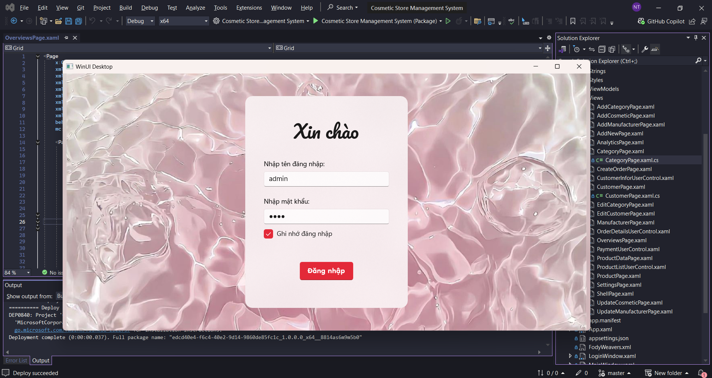
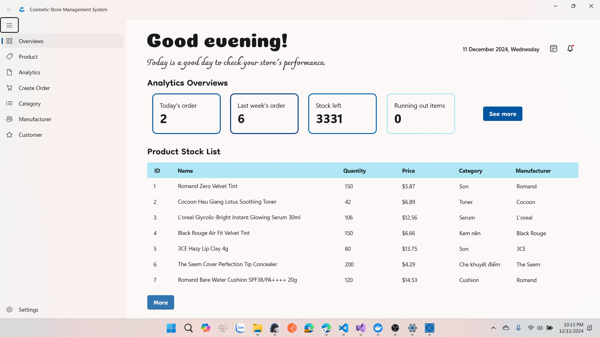
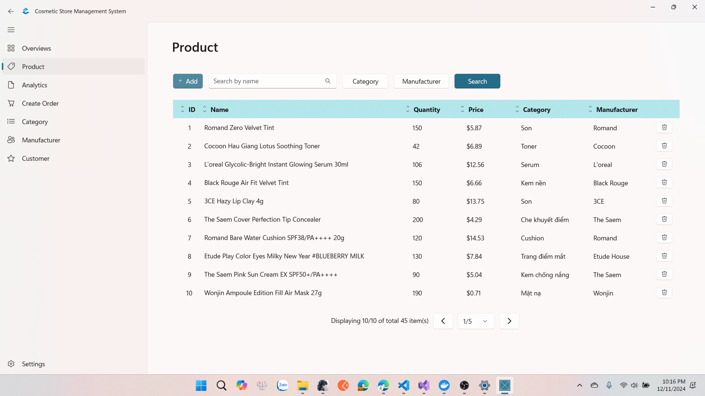
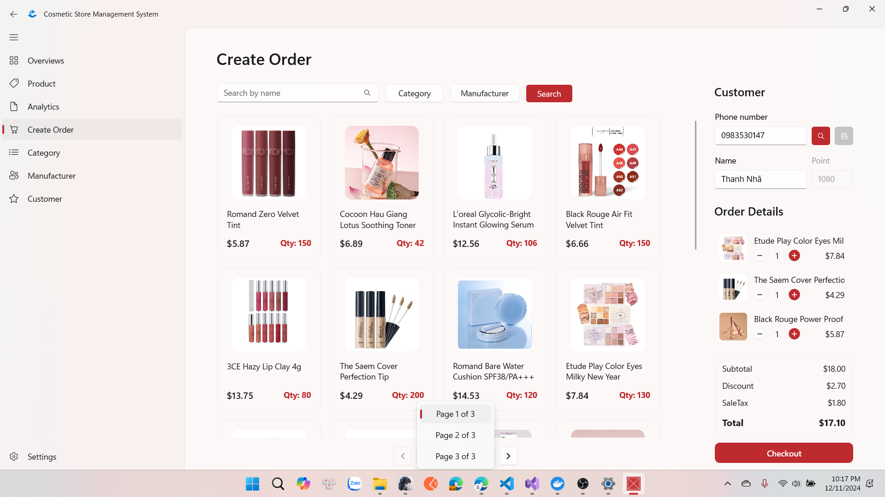
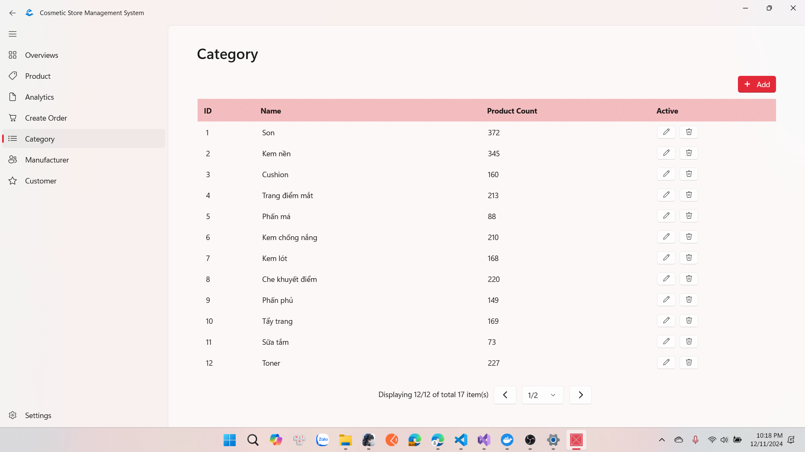
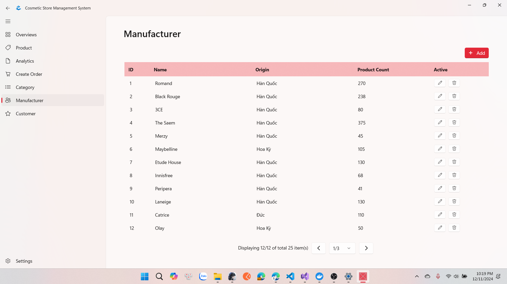
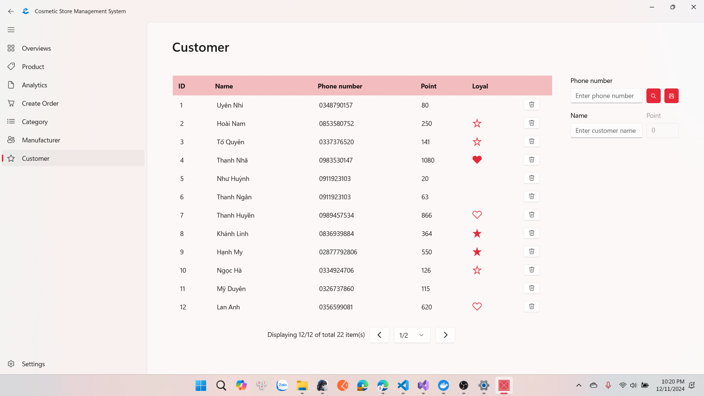
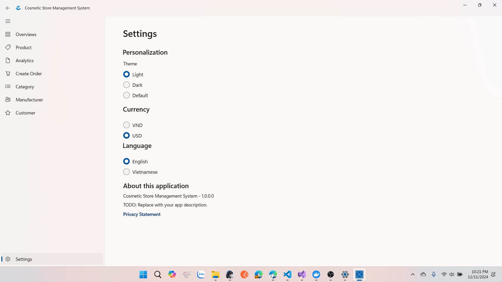
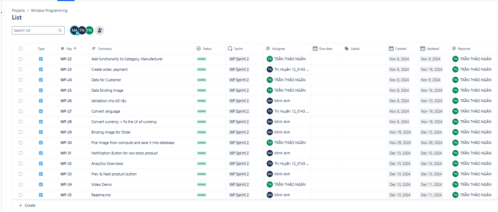

# Cosmetic Store Management System
## Window Programming - FIT HCMUS - 22/31

### Thành viên:

    1. 22120143 - Nguyễn Thị Huyền

    2. 22120213 - Đoàn Thị Minh Anh

    3. 22120225 - Trần Thảo Ngân

## 1. UI/UX
Màu sắc của ứng dụng có thể thay đổi theo màu sắc của máy tính.

Hoàn thành giao diện cho các trang:

- **Login** (Đăng nhập): (Username là admin, mật khẩu là 1234)
  
  

- **Overviews** (Tổng quan):
     
    + Các thông tin chung như Today's order, Last week's order, Stock left và Running out items được hiển thị đúng theo dữ liệu. Số giờ làm việc: **0.5h**
 
  

- **Product**: Hoàn thiện việc hiển thị sản phẩm với đầy đủ thông tin, bao gồm ảnh sản phẩm. Số giờ làm việc: **0.5h**

  

- **Create Order**:

  + Phần bên trái hiển thị danh sách sản phẩm, bao gồm các nội dung:
    
    - Hiển thị từng sản phẩm với hình ảnh, tên và số lượng sản phẩm.

    - Phân trang.

    - Tìm kiếm sản phẩm bằng tên.

    - Lọc tìm sản phẩm theo Category và Manufacturer.

    - Khi ấn vào một sản phẩm trong danh sách, sản phẩm đó sẽ được thêm vào đơn hàng bên phải chờ thanh toán.

  + Phần bên phải hiển thị khách hàng và chi tiết đơn hàng, cụ thể như sau:

    - Nhập tên và số điện thoại khách hàng để xem điểm và tích điểm.

    - Có thể đăng kí thành viên mới cho khách hàng.

    - Chi tiết đơn hàng bao gồm các sản phẩm được chọn vào đơn hàng, tên, hình ảnh và số lượng sản phẩm sẽ mua. Có nút tăng và giảm số lượng sản phẩm trong đơn hàng.

    - Đơn hàng thanh toán gồm tổng tiền sản phẩm, giảm giá theo khách hàng thân thiết và tiền thuế. Khách hàng sẽ phải thanh toán dựa theo số tiền Tổng thanh toán.

  + Tổng số giờ làm việc: **4.5h**
 
  
  
- **Category**: Hiển thị đầy đủ các thông tin về danh sách các danh mục như ID, tên, số lượng sản phẩm thuộc về danh mục đó và có nút để thêm, xóa, sửa danh mục. Số giờ làm việc: **0.5h**
  
  
  
- **Manufacturer**: Hiển thị đầy đủ các thông tin về danh sách các thương hiệu như ID, tên, xuất xứ, số lượng sản phẩm của thương hiệu và có nút để thêm, xóa, sửa thương hiệu. Số giờ làm việc: **0.5h**

  
  
- **Customer**: Hiển thị đầy đủ các thông tin về danh sách các khách hàng như ID, tên, số điện thoại, số điểm tích lũy và mức độ thân thiết. Ngoài ra còn có khung để thêm tên và số điện thoại khách hàng mới vào danh sách, cũng như nút xóa khách hàng. Số giờ làm việc: **1h**

  

- **Setting**: Người dùng có thể tùy chỉnh các cài đặt về chủ đề ứng dụng: Sáng, Tối hoặc Mặc định (Mặc định ở đây là theo màu của máy), có thể tùy chỉnh đơn vị tiền tệ: VND hoặc USD, có thể tùy chỉnh ngôn ngữ: Tiếng Việt hoặc Tiếng Anh.

  

Còn trang **Analytics** nhóm đã lên ý tưởng nhưng chưa làm hoàn chỉnh.

## 2. Design patterns / architecture

- Kiến Trúc: Được xây dựng theo kiến trúc chính là **MVVM (Model-View-ViewModel)**

  + Được sử dụng để tách biệt logic hiển thị (UI - View) và logic xử lý (ViewModel, Model).

  + ...Page (ví dụ như ProductPage, CreateOrderPage,...) đại diện cho View (giao diện người dùng).

  + ...ViewModel (ví dụ như ProductViewModel, CreateOrderViewModel,...) là ViewModel, chịu trách nhiệm xử lý logic nghiệp vụ và kết nối giữa View và Model.

  + Các Model như Cosmetic, Customer, OrderDetail là nơi lưu trữ dữ liệu và đại diện cho các đối tượng.

- Desgin Pattern:

  + DAO Pattern:
  
    - Truy cập dữ liệu được tách ra thành các lớp DAO (Data Access Object). Điều này giúp giảm sự phụ thuộc giữa tầng dữ liệu và tầng xử lý logic.

    - Các DAO như SQLOrderDAO, SQLOrderDetailDAO, SQLCosmeticDAO, SQLCustomerDAO,... chịu trách nhiệm giao tiếp với cơ sở dữ liệu.

  + Observer Pattern:
  
    - ObservableRecipient trong các ViewModel cho phép tự động thông báo khi dữ liệu thay đổi (phù hợp với UI động).

    - WinUI hỗ trợ mô hình này để UI tự động cập nhật khi dữ liệu trong ViewModel thay đổi.

  + Dependency Injection (DI):
  
    - Lớp ViewModel không tự khởi tạo DAO mà dựa vào các interface như IOrderDAO, IOrderDetailDAO, ICosmeticDAO. Điều này giúp dễ dàng thay thế hoặc mở rộng lớp DAO bằng cách sử dụng các phương thức như DI container hoặc factory.

    - IOrderDAO, IOrderDetailDAO được triển khai bởi các lớp SQLOrderDAO, SQLOrderDetailDAO.

  + Composite Pattern:

    - Trang Create Order có sử dụng UserControl. Mỗi UserControl là một thành phần độc lập, nhưng có thể được kết hợp để tạo ra các giao diện lớn hơn. Mỗi UserControl hoạt động độc lập nhưng giao tiếp qua các sự kiện hoặc ViewModel. 

    - CreateOrderPage sử dụng các UserControl như ProductListUserControl, CustomerInforUserControl, OrderDetailsUserControl để tạo nên giao diện đầy đủ.
      
- Tài Liệu Ghi Chú: Mỗi lớp và hàm đều được đặt tên rõ ràng, có các ghi chú chi tiết, giúp dễ hiểu khi làm việc nhóm và dễ dàng phát triển thêm.

## 3. Advanced topics

- **Chuyển đổi ngôn ngữ:** Ứng dụng cho phép người dùng thực hiện chuyển đổi giữa hai ngôn ngữ là Tiếng Việt và Tiếng Anh. 

    + Để thực hiện việc chuyển đổi ngôn ngữ, người dùng có thể vào trang Setting, chọn ngôn ngữ muốn chỉnh. Sau đó tắt ứng dụng và mở lại. Lúc này, ứng dụng sẽ hiển thị ngôn ngữ như mong muốn.
    
    + Số giờ làm việc: **1.5h**

- **Chuyển đổi đơn vị tiền tệ:** Ứng dụng cho phép người dùng thực hiện chuyển đổi giữa hai đơn vị tiền tệ là VND và USD. 

    + Để thực hiện việc chuyển đổi đơn vị tiền tệ, người dùng có thể vào trang Setting, chọn đơn vị tiền tệ muốn chỉnh. Lúc này, ứng dụng sẽ hiển thị đơn vị tiền tệ như mong muốn.
    
    + Số giờ làm việc: **0.5h**

- **Thông báo sản phẩm sắp hết hàng:** Trong trang Overviews có icon hình chuông để thông báo.
  
  + Icon Thông báo sẽ có chấm đỏ nếu có bất cứ sản phẩm nào gần hết hàng (còn không quá 10 sản phẩm). Khi ấn vào icon, có thể xem tên các sản phẩm còn số lượng ít, có thể chọn vào tên sản phẩm để đi đến trang thông tin của sản phẩm đó và thực hiện cập nhật số lượng. Số giờ làm việc: **0.5h**

## 4. Teamwork - Git flow

- Công Cụ Hợp Tác:

    + Họp nhóm được thực hiện qua **Discord**.
    

    + **Jira** được sử dụng để phân chia công việc và theo dõi tiến độ dự án.
    

- Git flow:

    + Các thành viên đẩy mã nguồn lên branch riêng.

    + Leader nhóm sẽ kiểm tra và hợp nhất mã đã kiểm duyệt vào nhánh chính (master).

    

## 5. Quality assurance

- Quy Trình Kiểm Duyệt Mã Nguồn:
  
  + Trước khi push code lên, các thành viên cần tự kiểm tra code của mình đảm bảo được các yêu cầu: Biến được đặt tên có ý nghĩa, Không có code trùng lặp và Xử lý lỗi đầy đủ (nếu có).

  + Sau khi push và tạo pull request, mã nguồn được leader kiểm duyệt (giải quyết xung đột nếu có) trước khi hợp nhất. Các thành viên trong nhóm hỗ trợ việc giải quyết xung đột trong code (nếu cần).

  + Sau khi hoàn thành kiểm duyệt, cần tổng hợp các vấn đề đã phát hiện và cách khắc phục. Từ đó, có thể rút ra được phần cần phải tối ưu và lỗ hổng trong quy trình phát triển phàn mềm cần khắc phục sau này.

- Quy trình đảm bảo chất lượng:

  + Unit test: Nhóm có thiết kế unit test hỗ trợ kiểm tra chức năng chuyển đổi ngôn ngữ và chuyển đổi tiền tệ.

  + Automation test: Nhóm có thiết kế automation test cho chức năng Add Category, Add Manufacturer và Login.

  + Test thủ công:
  
    - Sau các chức năng được thêm vào làm phần code trước đó có sự thay đổi thì thành viên thực hiện chức năng đó sẽ test các chức năng có liên quan để đảm bảo mọi thứ chạy ổn định và không có lỗi.

    - Sau khi thực hiện hợp nhất code từ các nguồn, các thành viên sẽ test lại chức năng mình thực hiện và các chức năng có liên quan để đảm bảo việc merge code không có vấn đề gì.
  

## 6. Bảng phân công công việc:

|      MSSV      | Họ và tên               | Công việc                        |
|----------------|-------------------------|----------------------------------|
|    22120143    | Nguyễn Thị Huyền        |- Chuyển đổi ngôn ngữ và test tương ứng  - Tạo trang Create Order và Payment  - Hiển thị các thông tin về Analytics trong trang Overviews   - Tạo automation test cho Add Category, Add Manufecturer và Login |
|    22120213    | Đoàn Thị Minh Anh       |- Chuyển đổi đơn vị tiền tệ và test tương ứng  - Thực hiện Validation cho việc thêm, sửa dữ liệu  - Tạo nút Thông báo sản phẩm sắp hết hàng trong trang Overviews  - Thực hiện Binding Image cho trang Create Order  - Viết file README.md  |
|    22120225    | Trần Thảo Ngân          |- Tạo và hoàn thiện các trang Category, Manufacturer và Customer  - Thực hiện Binding Image cho trang Product  - Thực hiện chức năng thêm ảnh cho sản phẩm  - Thực hiện các thiết kế về UI  - Quay video demo                       |
