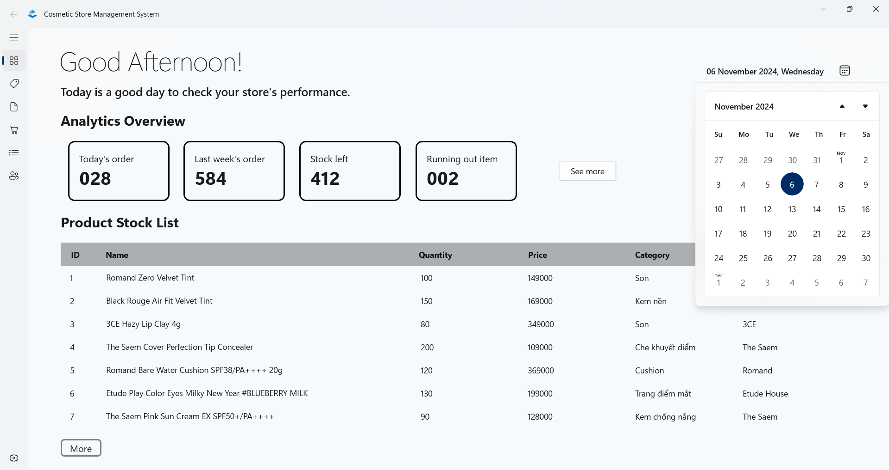
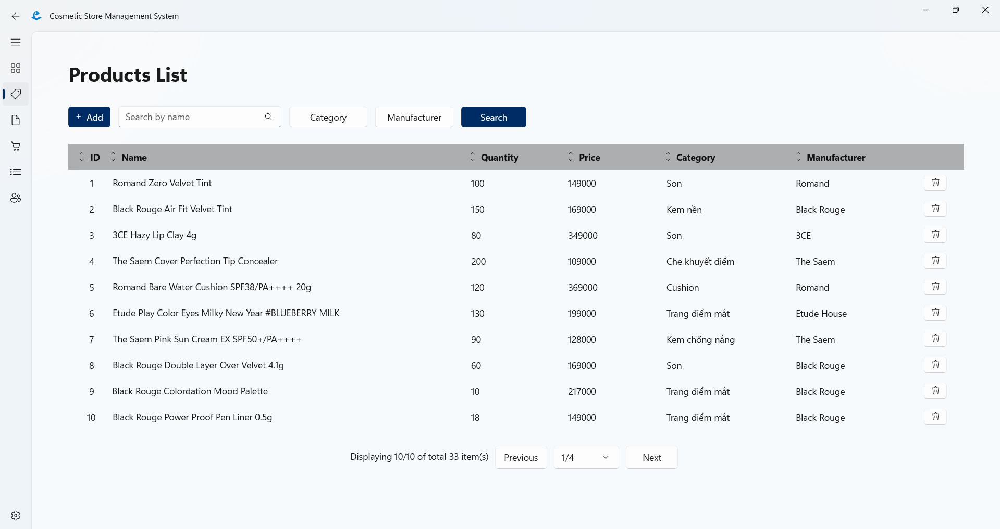
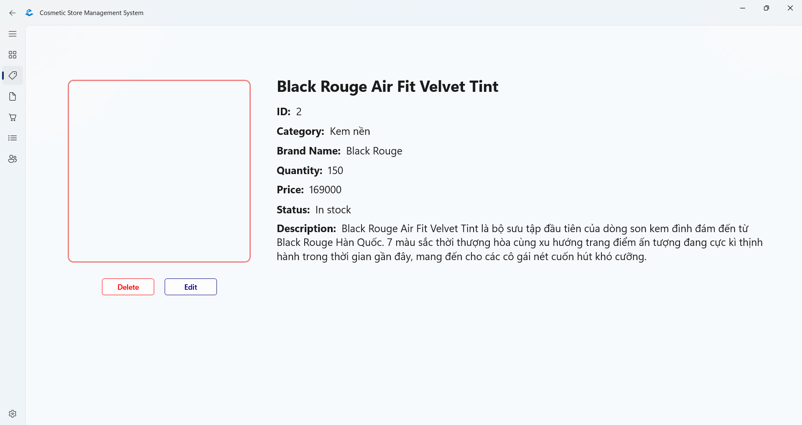
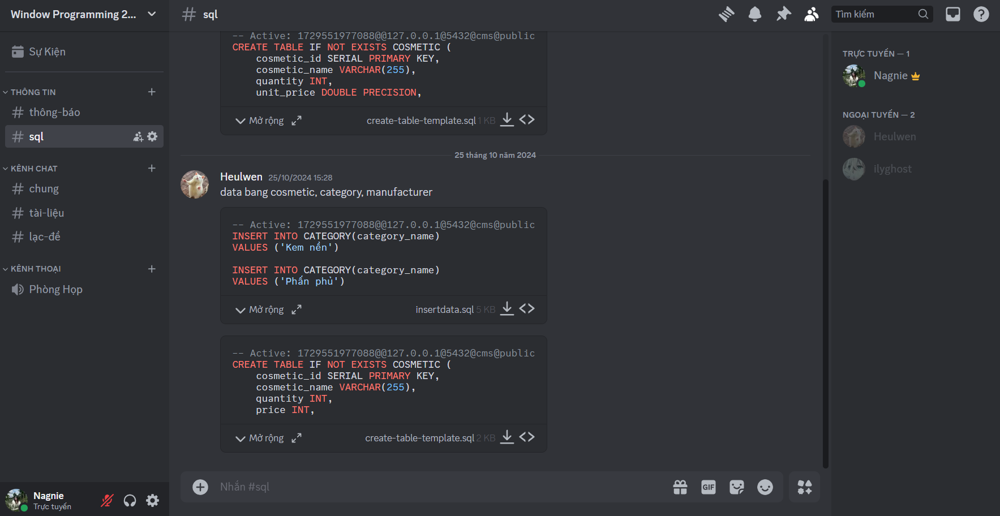
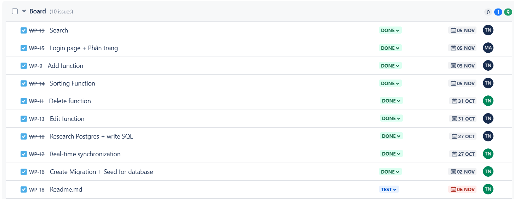
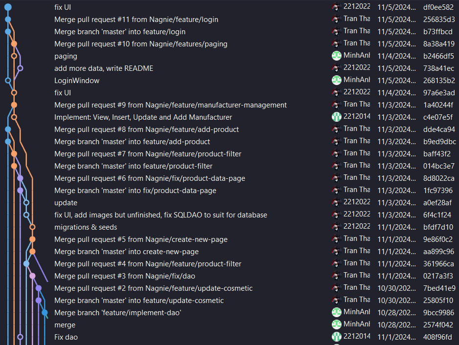

# Cosmetic Store Management System
## Window Programming - FIT HCMUS - 22/31

### Thành viên:

    1. 22120143 - Nguyễn Thị Huyền

    2. 22120213 - Đoàn Thị Minh Anh

    3. 22120225 - Trần Thảo Ngân

## 1. UI/UX
Hoàn thành giao diện cho các trang:

- **Login** (Đăng nhập): Username là admin, mật khẩu là 1234, và được code cứng. Có chế độ Remember me để tự động lưu Username và Password cho các lần đăng nhập tiếp theo. Số giờ làm việc: **0.5h**

- **Overviews** (Tổng quan): Bao gồm phần header, phần Analytics Overview hiển thị được code cứng, và danh sách sản phẩm tổng quát, ấn vào nút More ở dưới cùng sẽ đến trang Product Data. Số giờ làm việc: **1h**

    

- **Product Data**: hiển thị danh sách tất cả sản phẩm, bao gồm ID, Name, Quantity, Price, Category và Manufacturer. Có các chức năng:

    + Phân trang.
    
    + Thêm sản phẩm mới.

    + Tìm kiếm bằng tên.

    + Lọc sản phẩm theo Category và Manufacturer.

    + Sắp Xếp Sản Phẩm theo ID, Tên, Số Lượng, Giá, Category, và Manufacturer, có thể chọn tăng hoặc giảm dần.

    + Khi ấn vào tên một sản phẩm thì sẽ hiện ra trang Product, hiển thị thông tin chi tiết của sản phẩm đó.

    + Tổng số giờ làm việc: **3.5h**

    

- **Product**: hiển thị hình ảnh, tên, ID, số lượng, giá cả, danh mục và nhà sản xuất, trạng thái (còn hàng hay hết hàng) và mô tả. Bên dưới hình ảnh là hai nút Delete (dùng để xóa sản phẩm) và Edit (dùng để chỉnh sửa thông tin sản phẩm). Số giờ làm việc: **1h**

    

- **Data Binding**: Đã thực hiện data binding dạng văn bản, và đang tiếp tục tìm hiểu cách ràng buộc dữ liệu hình ảnh. Số giờ làm việc: **2h**

Các trang còn lại (**Analytics**, **Category**, **Manufacturer**, **Create Order**) nhóm đã lên ý tưởng nhưng chưa làm hoàn chỉnh.

## 2. Design patterns / architecture

- Kiến Trúc: Được xây dựng theo mẫu **MVVM (Model-View-ViewModel)**

- Tài Liệu Ghi Chú: Mỗi lớp và hàm đều có ghi chú chi tiết, giúp dễ hiểu và phát triển thêm.

## 3. Advanced topics

- **Đồng bộ thời gian thực:** Ứng dụng đồng bộ thời gian nội bộ với thời gian thực ở trang Overviews. Cụ thể:

    + Dòng chữ "Good Morning/Afternoon/Evening" sẽ thay đổi theo thời gian trong ngày.

    + Bên góc phải màn hình hiển thị ngày tháng năm theo thời gian của máy tính.

    + Khi ấn vào icon bên cạnh thì sẽ hiện ra lịch.
    
    + Số giờ làm việc: **0,5h**

- Sắp Xếp Sản Phẩm theo ID, Tên, Số Lượng, Giá, Category, và Manufacturer, có thể chọn tăng hoặc giảm dần.

- Tạo các file migration và seed, thêm dữ liệu cho databse. Số giờ làm việc: **1.5h**

## 4. Teamwork - Git flow

- Công Cụ Hợp Tác:

    + Họp nhóm được thực hiện qua **Discord**.
    

    + **Jira** được sử dụng để phân chia công việc và theo dõi tiến độ dự án.
    

- Git flow:

    + Các thành viên đẩy mã nguồn lên branch riêng.

    + Leader nhóm sẽ kiểm tra và hợp nhất mã đã kiểm duyệt vào nhánh chính (master).

    

## 5. Quality assurance

Quy Trình Kiểm Duyệt Mã Nguồn: Mã nguồn được leader kiểm duyệt (giải quyết xung đột nếu có) trước khi hợp nhất.

